# BingoCaller

A bingo **number caller** with a **big-screen display** for a projector or TV. You click each number
as it is drawn; the audience sees it huge on the big screen, together with everything called so far,
sponsor logos, a scrolling banner and an optional photo slideshow.

Made for clubs, schools, charities and friends. Free to use — see [License](#license) and
[the spirit of use](#the-spirit-of-use).

> **Status:** version 1.0.1. Windows only. Personal project, maintained in the author's spare time.

## Screenshots

Every logo, picture and name in these screenshots is a made-up placeholder (see [`assets/`](assets/)).

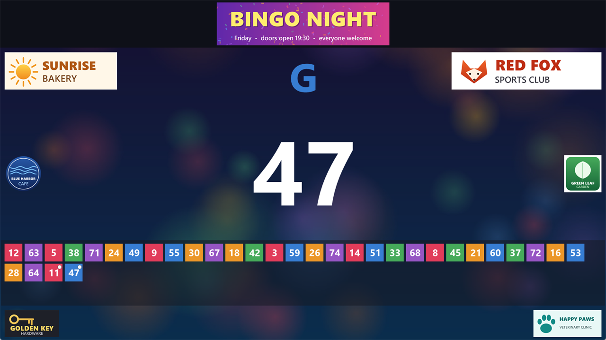
*The big screen mid-game: photo slideshow behind the numbers, banner, six sponsor logos and a see-through numbers strip.*

| | |
|---|---|
| 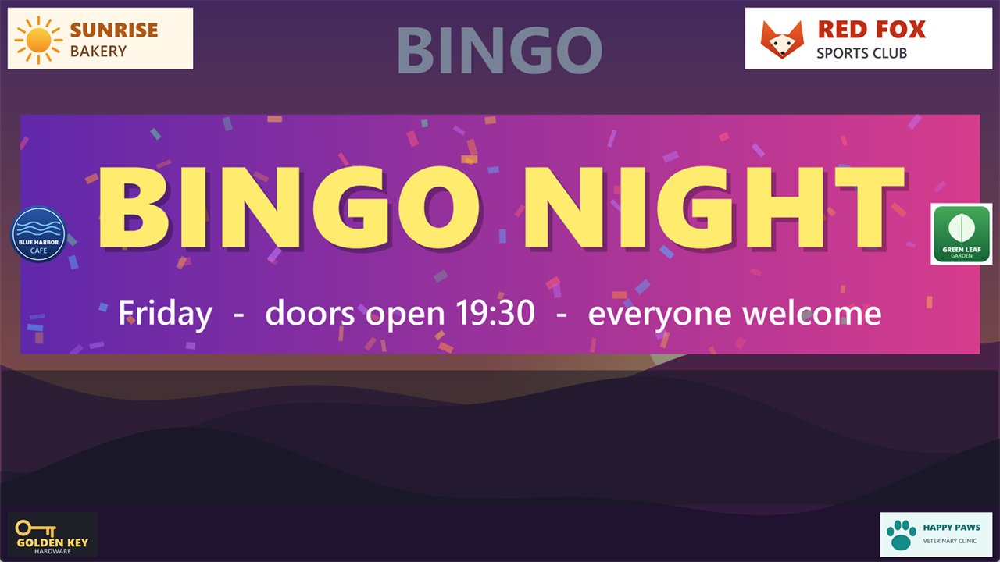 | 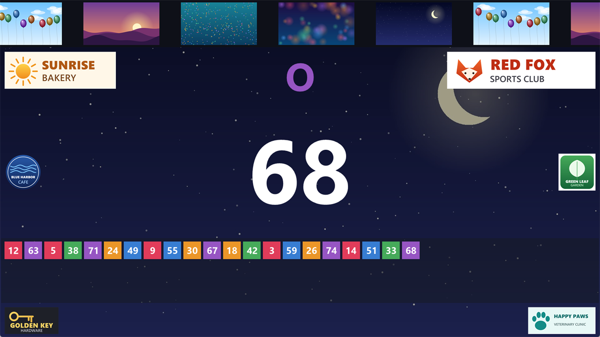 |
| *Before the first number: the banner shown big.* | *The slideshow images scrolling through the banner.* |
|  | 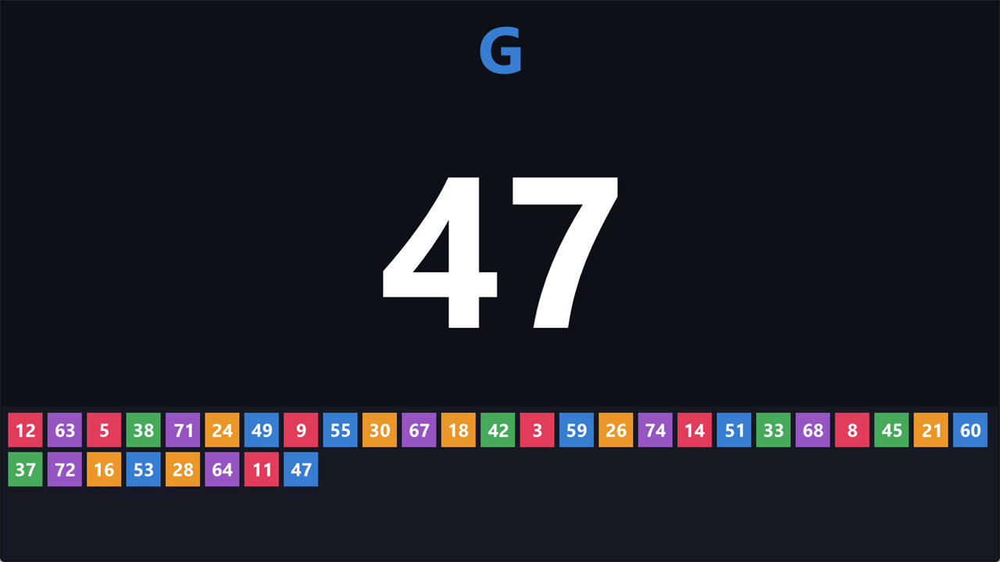 |
| *Pause: the slideshow alone, full screen.* | *The clean default look, nothing configured.* |

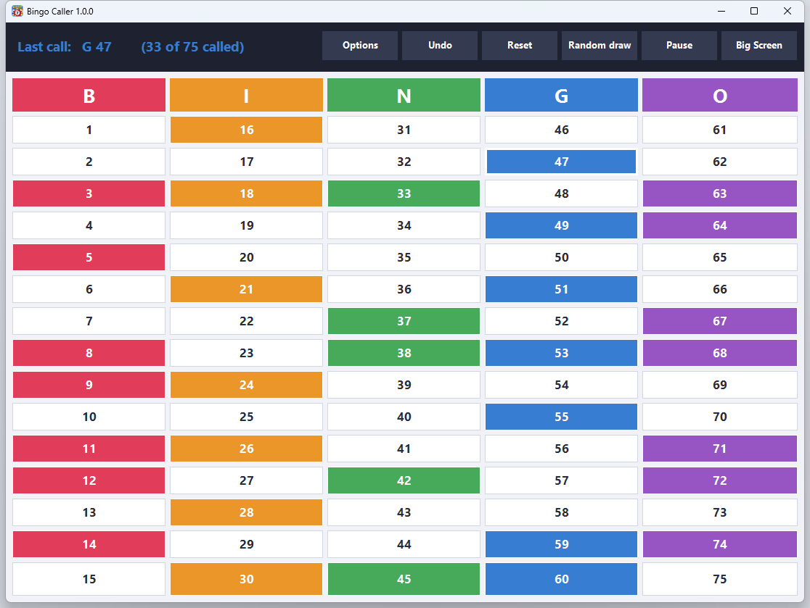
*The caller window: click a number as it is drawn. Called numbers are coloured by column.*

| | |
|---|---|
| 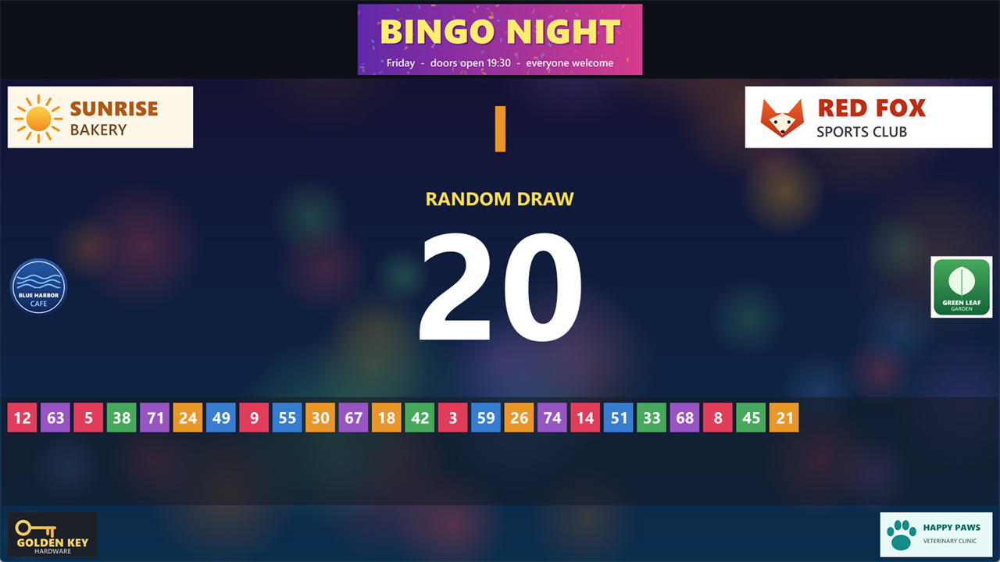 | 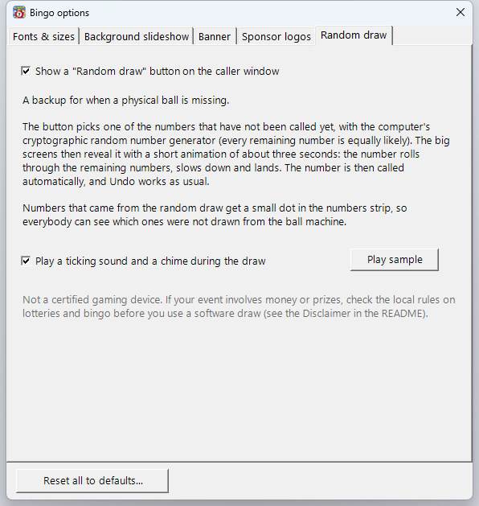 |
| *Optional random draw: the number rolls, then lands. Randomly drawn numbers get a dot in the strip (see 11 and 47 above).* | *Switch it on in Options → Random draw. The button appears on the caller window.* |

| | |
|---|---|
| 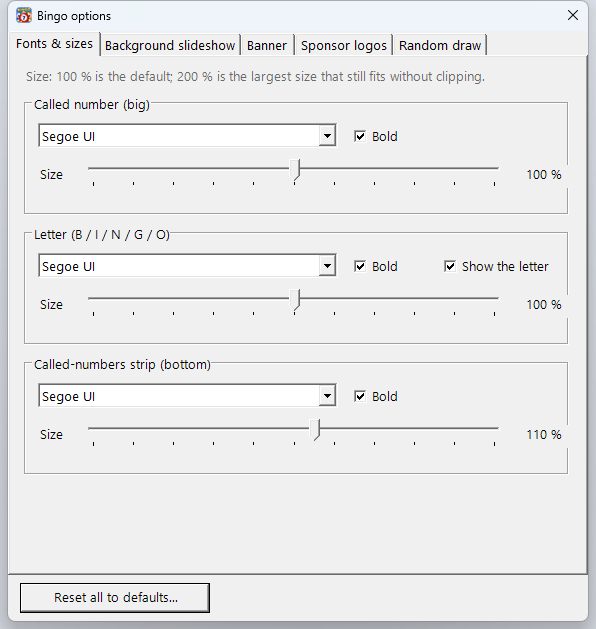 | 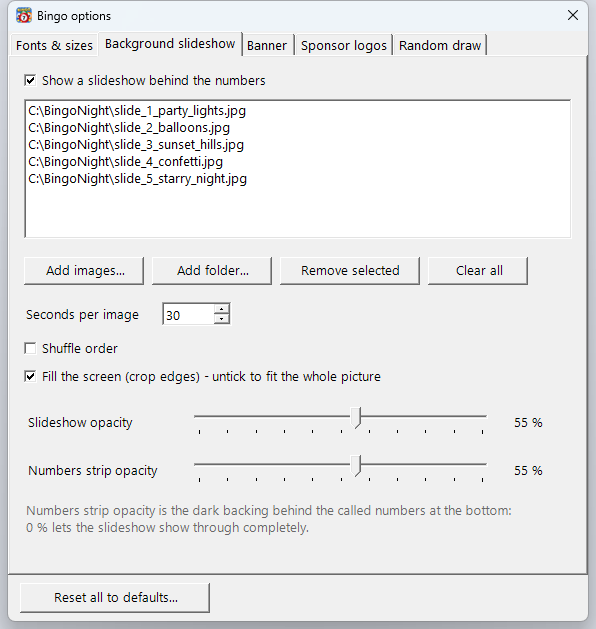 |
| 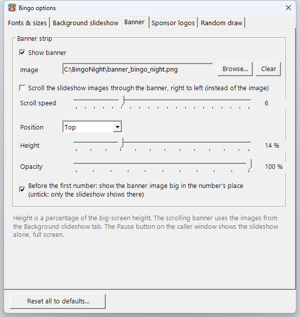 | 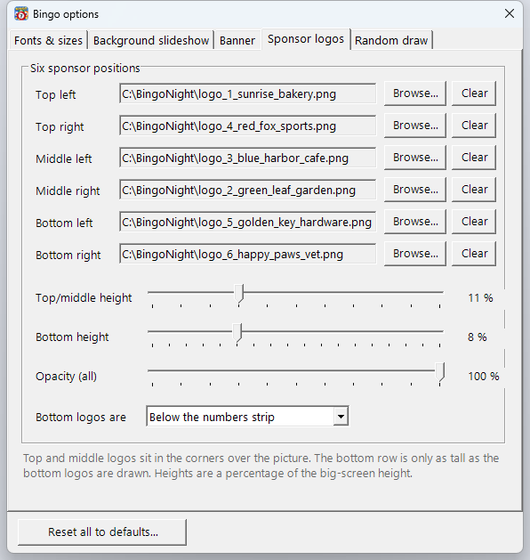 |

*Options: every change shows on the big screen immediately. The bottom logos can also sit above the numbers strip
([example](docs/screenshots/big-screen-logos-above.png)), and a dialog lets you tick several monitors
([screenshot](docs/screenshots/choose-screens.png)).*

## Features

- **Caller window** — 75 buttons in the classic B-I-N-G-O columns (1–15, 16–30, 31–45, 46–60, 61–75).
  Click a number to call it. **Undo** takes back the last call, **Reset** starts a new game.
  By default the numbers are entered by you (from your ball machine or draw) and the app does not generate any.
- **Random draw (optional backup)** — off by default; switch it on in *Options → Random draw*. A **Random draw** button then
  picks one of the not-yet-called numbers with the computer's cryptographic random number generator (every remaining
  number is equally likely) and reveals it on the big screens with a short animation: the number rolls through the
  remaining numbers, slows down and lands, with a ticking sound that slows down and a rising chime (the sound can be
  switched off in the same Options tab, with a *Play sample* button). It is called automatically (Undo works), and randomly drawn numbers get a small
  dot in the numbers strip so everyone can see they did not come from the ball machine. Meant for emergencies such as a
  missing ball.
- **Big screen** — the current number and its letter as large as the screen allows, plus a strip that always
  shows **all** called numbers (never scrolls — chips resize so all 75 fit). `F11` toggles full screen, `Esc` leaves it.
- **Several monitors at once** — tick every monitor that should show the big screen; **Identify** flashes a number
  on each monitor so you can tell them apart. Your choice is remembered.
- **Pause** — one click and every big screen shows only the slideshow, full screen and fitted. While paused, picking
  numbers and **Undo** are blocked (the caller window says PAUSED), so nothing changes by accident. Click **Resume** to return.
- **Photo slideshow** as the background (cross-fade, shuffle, crop-to-fill or fit, adjustable opacity), and the
  numbers strip can be see-through so the pictures show behind the drawn numbers.
- **Banner** — one image, or the slideshow images **scrolling right to left** (adjustable speed), at the top or bottom,
  with its own opacity. Before the first number is called it can be shown big in the number's place.
- **Six sponsor logos** — top, middle and bottom, left and right; bottom logos can sit below or above the numbers strip.
- **Fonts and sizes** — choose the font for the number, the letter and the strip; every size slider runs 0–200 %
  (100 % is the default, 200 % is the largest size that still fits). The letters can be hidden.
- **Reset all to defaults** in Options, at any time.

## Requirements

- Windows 10 or 11, 64-bit
- [.NET 8 Desktop Runtime (x64)](https://dotnet.microsoft.com/download/dotnet/8.0) — the installer checks for it

## Install

Download the installer from the GitHub **Releases** page and run it. It installs **for the current user only** (no
administrator rights needed) so the program can save its settings next to itself. Verify the download against the
published SHA256 checksum if you like:

```powershell
Get-FileHash .\setup_BingoCaller_1.0.1.exe -Algorithm SHA256
```

The installer is not code-signed (see [SECURITY.md](SECURITY.md)); Windows SmartScreen may show a warning.

## Using it

1. Start **BingoCaller** and click **Big Screen**. Pick the monitor(s) for the projector/TV and press **Show**.
2. Click numbers as they are drawn. The big screen updates instantly.
3. Open **Options** to set fonts, slideshow, banner and logos — changes appear on the big screen immediately.
4. **Pause** shows the slideshow alone (for breaks); **Resume** goes back to the numbers.

Tip: use *your own* pictures and logos. Sponsor logos and photos are **not** included and you are responsible for
having the right to show them.

## Where settings are stored

In one file next to the program: **`BingoCaller.settings.json`**. There is no registry use and nothing is written to
AppData. To reset everything, use **Options → Reset all to defaults…**, or close the program and delete that file.
The program never makes network connections and collects no data.

## Build from source

```powershell
dotnet build BingoCaller.slnx -c Release          # .slnx needs .NET SDK 9.0.200 or newer
dotnet build BingoCaller\BingoCaller.csproj -c Release   # works with the .NET 8 SDK too
```

To build the installer you also need [Inno Setup 6](https://jrsoftware.org/isinfo.php):

```powershell
.\Build-Release.ps1      # publishes, compiles the installer into .\dist, writes a SHA256 file
```

More background for contributors is in [docs/DEVELOPMENT_NOTES.md](docs/DEVELOPMENT_NOTES.md).

## Contributing

Bug reports, ideas and pull requests are welcome — please open an issue first for larger changes. Security problems:
see [SECURITY.md](SECURITY.md) and do **not** file a public issue.

## Documents

| File | What |
|------|------|
| [LICENSE](LICENSE) | MIT License |
| [SECURITY.md](SECURITY.md) | How to report a vulnerability, security design, supported versions |
| [CHANGELOG.md](CHANGELOG.md) | Release history |
| [sbom.json](sbom.json) | Software Bill of Materials (CycloneDX) |
| [SECURITY_REVIEW_2026-09-26.md](SECURITY_REVIEW_2026-09-26.md) | Source-level security review |
| [CRA/](CRA/) | EU Cyber Resilience Act scope statement, technical documentation, threat model, gap checklist |
| [Disclaimer](#disclaimer) | No warranty, your responsibility for the game, local gambling law, third-party logos |

## Disclaimer

- **No warranty.** BingoCaller is provided "as is", without warranty of any kind (see the [MIT License](LICENSE)). The
  author is not liable for any damage or loss arising from its use — including a failure or display error during an
  event. Test it with your equipment before the evening starts, and keep a paper backup of the called numbers.
- **You are responsible for the game.** The program records and displays the numbers that *you* enter. Only if you switch on
  the optional *Random draw* does it pick a number itself (with the operating system's cryptographic random generator);
  even then it cannot guarantee that a game is fair or that a card is a winner. It is not a certified gaming device, and a
  software draw may be treated differently from a ball draw where prizes are involved — check your local rules.
- **Follow the law.** Bingo, lotteries and raffles — especially with money or prizes — are regulated in many countries
  and may need a licence or permit. Finding out and following the rules that apply to your event is the organiser's job,
  not the software's.
- **Your content, your rights.** Pictures, logos and names you load (sponsors, photos) are not included with the program;
  you must have the right to show them. All trademarks and logos belong to their respective owners, and nothing here
  implies endorsement by them.
- **Independent project.** This is a personal, non-commercial project. It is not a product of, and not endorsed by, any
  employer, company or sponsor. Microsoft, Windows and .NET are trademarks of Microsoft Corporation.
- **Not legal advice.** The documents in [`CRA/`](CRA/) and [`SECURITY.md`](SECURITY.md) are the author's good-faith
  information, not legal advice or a compliance certificate.

## License

[MIT](LICENSE) — free to use, copy, modify and share, including for organisations. Provided as-is, without warranty.

## The spirit of use

I wrote this to help people have a good time and raise money for good causes. I would love it to be used for the
better good — community events, schools, clubs, charities. That is a **request**, not a license condition: the MIT
License applies in full. (A vague "for the better good" restriction could not be enforced fairly and would keep some
schools, clubs and companies from using the tool, so I chose not to write one into the license.)

This is a personal project and is not a product of, or endorsed by, any employer or company.
